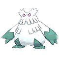
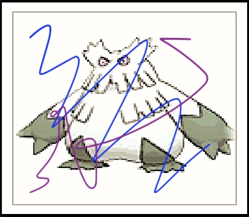

# Image Index (imgidx)

__imgidx__ is a simple image indexing tool for searching similar or the same images
regardless of their format, size, and compression.

Basically,We can distinguish three cases of image search (sorted by increasing complexity):

1. Search for exactly the same file. In this case, we simply can use file hashes to match them.
2. Searching for the same image with different sizes/formats/compression/watermarks/etc.: __this is the use case imgidx designed for__.
3. Searching for different pictures of the same or similar objects. E.g. searching for a photo of the same thing from another angle, face recognition, etc. This problem is usually solved by CNN or other Deep Learning technics, imgidx is too dumb for this task.

## Usage
### Index Initialization
#### Create non-persistent index with default embedder
```go
package main

import (
	"github.com/alef-ru/imgidx"
)

idx, err := imgidx.NewCompositeIndex(8, 8)
// Handle the error
```

#### Create persistent index with default embedder
```go
package main

import (
	"github.com/alef-ru/imgidx"
	"gorm.io/driver/sqlite"
)
idx, err = imgidx.NewPersistentCompositeIndex(8, 8, sqlite.Open("imgidx.db"))
```
Embedder is a component that represents an image as a vector of floats. You can develop your own embedder.

### Add images to index
```go
var img image.Image
// ... init img... 
_, err := idx.AddImage(img, "image unique identifier", attributes)
// .. handle err ...
```
You can also add images by their URL or path to a local file
```go
_, err = imgidx.AddImageUrl(idx, "https://example.com/image.jpeg", attributes)
_, err = imgidx.AddImageFile(idx, '/path/to/image.png', attributes)
```
`attributes` is whatever additional information you want to associate with the image

### Find image
Likewise, adding an image, there are three ways to find the nearest to given image in the index.
```go
uri, attrs, dist, err = idx.Nearest(img)
uri, attrs, dist, err = imgidx.NearestByFile(idx, path)
uri, attrs, dist, err = imgidx.NearestByUrl(idx, url)
```
this functions return the same set of variables:
* `uri`: a unique image id: URL, the full path to file, or something custom, depending on  how the image was added
* `attrs`: whatever you passed to AddImage*() method when adding the image
* `dist`: distance between the given and found image. The less the distance - the more similar the images

## Supported image formats
1. JPEG
2. PNG
3. GIF

## Examples
Here is a simple example of indexing and searching images with sample data.

For the full code of this example, please refer to the [simple_demo](_examples/simple_demo/main.go)

Let's say we have 20 [images with pokemons](testdata/pokemon) and we want to find a few images against it.

### Original image


This image (exactly the same file) was indexed, so Index.Nearest() finds it and returns the __distance is 0__.

### Compressed image


This image was made of the previous one, but it has a different format, JPEG instead of PNG, and was severely compressed, so compression artifacts became visible.

Index.Nearest() finds the proper image, but the distance in this case __0.023425__

### Severely altered image


This image was made of the original one, with a number of modifications:
1. It was up upscaled and converted to JPEG
2. It was squished a bit
3. It has frames and some extra lines drawn on top

So, basically, this image is different from any of the indexed images. But Index.Nearest() can still find the original image.
Distance, in this case, is __1.922400__

### Another image
If we try to remove the original image from the index and try to find it again, the index will return some other image.
In our case this one:


Distance:  __3.108842__